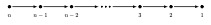
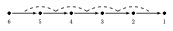
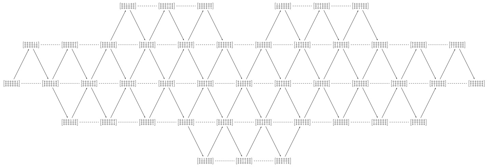
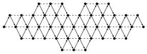
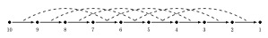
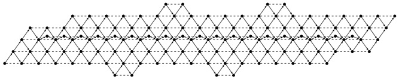

# Extended module categories of linear Nakayama algebras

This tool computes and visualises algebraic structures called extended module categories. These are objects of interest in higher homological algebra.

Given a linear Nakayama algebra as input (defined by its size, relations, and extension parameter), the program computes a finite portion of the postprojective component of the extended module category and renders it as a publication-ready diagram. Output is generated as a TikZ/LaTeX PDF, with full control over layout, scaling, and node representation.

The project was developed to assist in the exploration and illustration of the paper *A note on the $m$-extended module categories of Nakayama algebras* (https://arxiv.org/abs/2601.14843). It is open for anyone wanting to use it in their own research.

### What it does, concretely
- Takes an algebra specification as input (number of simples, extension parameter, relations)
- Computes the structure of the resulting extended module category up to a chosen cutoff
- Renders the output as an AR-quiver — a directed graph encoding the indecomposable objects and morphisms of the category
- Exports a publication-ready PDF via LaTeX/TikZ
- Offers an interactive Computer Line Interface (CLI) for adjusting layout and recompiling without rerunning the full computation

## Output Examples:

The linear Nakayama algebras are given by the path algebras of 



with some admissible relations.

### $3$-extended module category of $\Lambda(6,2)$


The $3$-extended module category of the linear Nakayama algebra with $6$ nodes and homogeneous relations of length $2$ (Denoted by $3\operatorname{-mod}\Lambda(6,2)$), can be printed with or without dimension vectors as shown below.

$3\operatorname{-mod}\Lambda(6,2)$ with dimension vectors:


$3\operatorname{-mod}\Lambda(6,2)$ without dimension vectors:


### $2$-extended module category of $\Lambda(10,4)$
The $2$-extended module category of the algebra given by



printed without dimension vectors looks like:


## Prerequisites
1. Python 3.8 or higher with Numpy installed
2. A tex installation

## Getting Started
1.	Clone the Repository:

```bash
git clone https://github.com/endresr/extendedModules.git
```
## Usage
Run the main program

```bash
python main.py
```

The program first asks you to input the extended module category you want to calculate.
1. First the amount of simples $n$ in your Nakayama algebra
2. The extension $m$ you want
3. The cutoff-value for the calculation. NB! If the resulting category is too large or infinite, a high cutoff-value might lead to the PDF not being generated
  - If the PDF is not generated, you can try the following fixes:
    - Change the cutoff-value
    - Change the scaling-factors
    - Print only nodes instead of the cohomological dimension vectors.
4. The relations of the algebra.
  - If you want homogeneous relations, you give a number less than the amount of simples
  - If you want other relations, input a list of tuples associated to the minimal relations
You are then asked if you want the PDF to be generated with standard configurations. If not, you may choose
5. The y-levels of the $\tau$-orbits as a list of numbers (Starting with the y-level for the projective in vertex 1).
6. The x- and y-scale as a tuple of numbers
7. The scale for the nodes in the tikz-diagram
8. If you want to print the nodes as cohomological dimension vectors or as filled circles.

The PDF is then generated in the main folder as "preview.pdf" along with the tex-file, and you get the following choices
1. Redraw using custom settings (You can then change the settings in steps 5.-8.)
    1. Change y-levels
    2. Set x- and y-scales
    3. Scale nodes
    4. Print cohomological dimension vectors
    5. Go through all settings
2. Start from the beginning
3. Change the cutoff for the initial calculations
4. Save output files (Saved files are stored in the folder /AR-quivers/)
5. Quit

## Project Structure

```
extendedModules
├── AR-quivers/         # Saved files are stored here
│   └── 
├── Archive/            # Old files 
│   └── 
├── modules/
│   ├── classes.py      # Extendedmodule class definition and the Tau-function
│   ├── functions.py    # Basic functions for computations
│   ├── drawGraph.py    # Code to construct the Latex file and compiling it
├── main.py             # Main program
└── README.md
```


## License

This project is licensed under the MIT License. See the LICENSE file for details.

